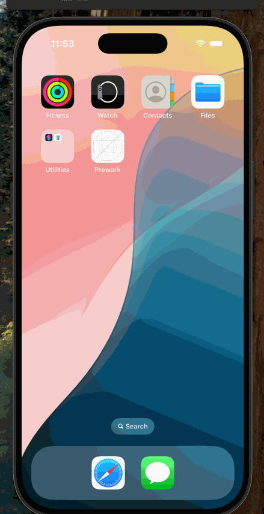

# Prework - Colorworks

Submitted by: Jadine Delfin-Watanabe

Colorworks is an app that displays three labels and a button. When the button is tapped, the background color changes to a random color.

Time spent: 6 hours spent in total

## Required Features

The following **required** functionality is completed:

- [x] User sees a screen with three labels and a button  
- [x] Tapping the button changes the screen color to a random color

## Video Walkthrough

## App Brainstorming (Step 4)

## Notes

Describe any challenges encountered while building the app.  
- This is the first mobile app I have created with Swift, so a lot of the time was spent learning about different features and functions of Swift and Xcode.  
- Once I was more familiar with everything, completing the creation of the app did not take as much time as the initial setup, downloading, and review of all the information.  
- The colors and functionality are simple for now to ensure that all required steps were completed.

## License

    Copyright [2025] [Jadine Delfin-Watanabe]

    Licensed under the Apache License, Version 2.0 (the "License");
    you may not use this file except in compliance with the License.
    You may obtain a copy of the License at

        http://www.apache.org/licenses/LICENSE-2.0

    Unless required by applicable law or agreed to in writing, software
    distributed under the License is distributed on an "AS IS" BASIS,
    WITHOUT WARRANTIES OR CONDITIONS OF ANY KIND, either express or implied.
    See the License for the specific language governing permissions and
    limitations under the License.
